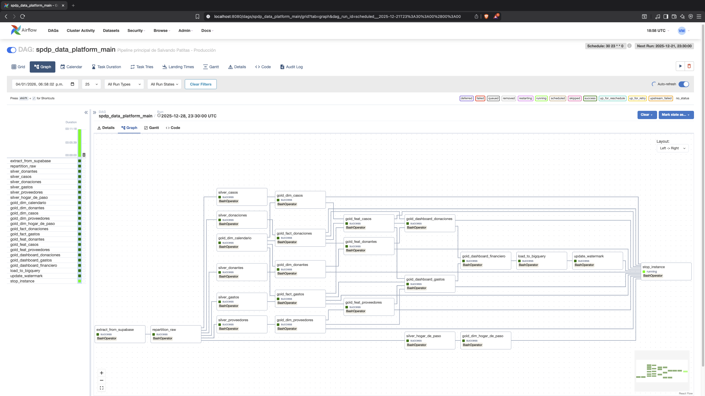
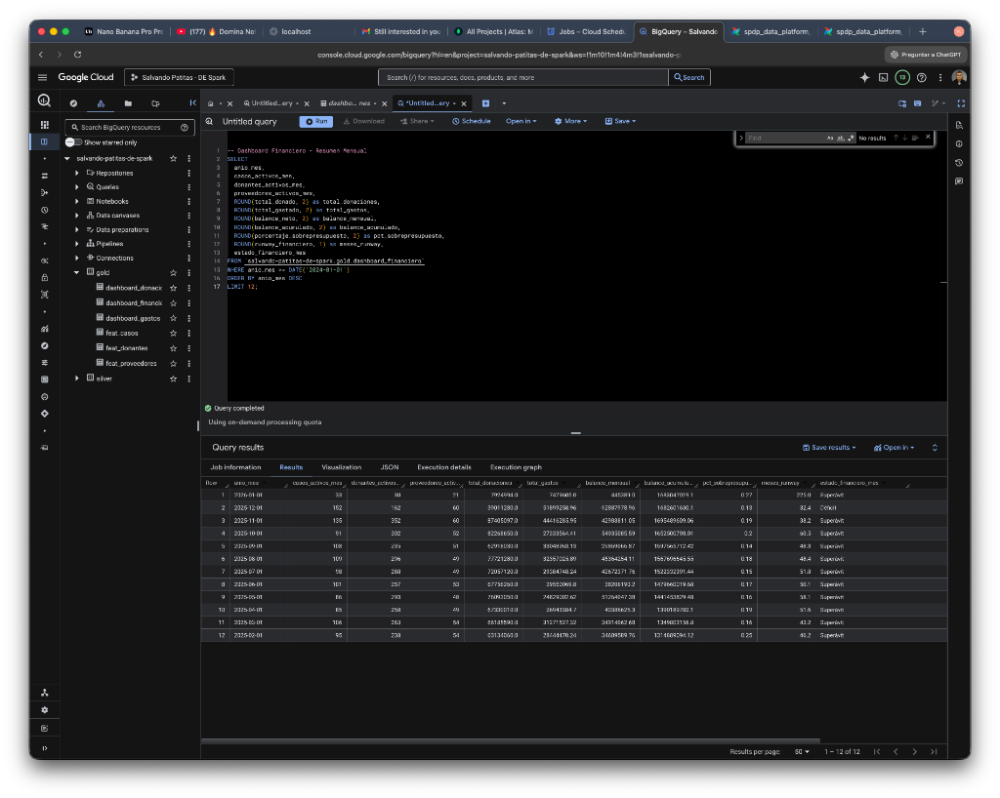
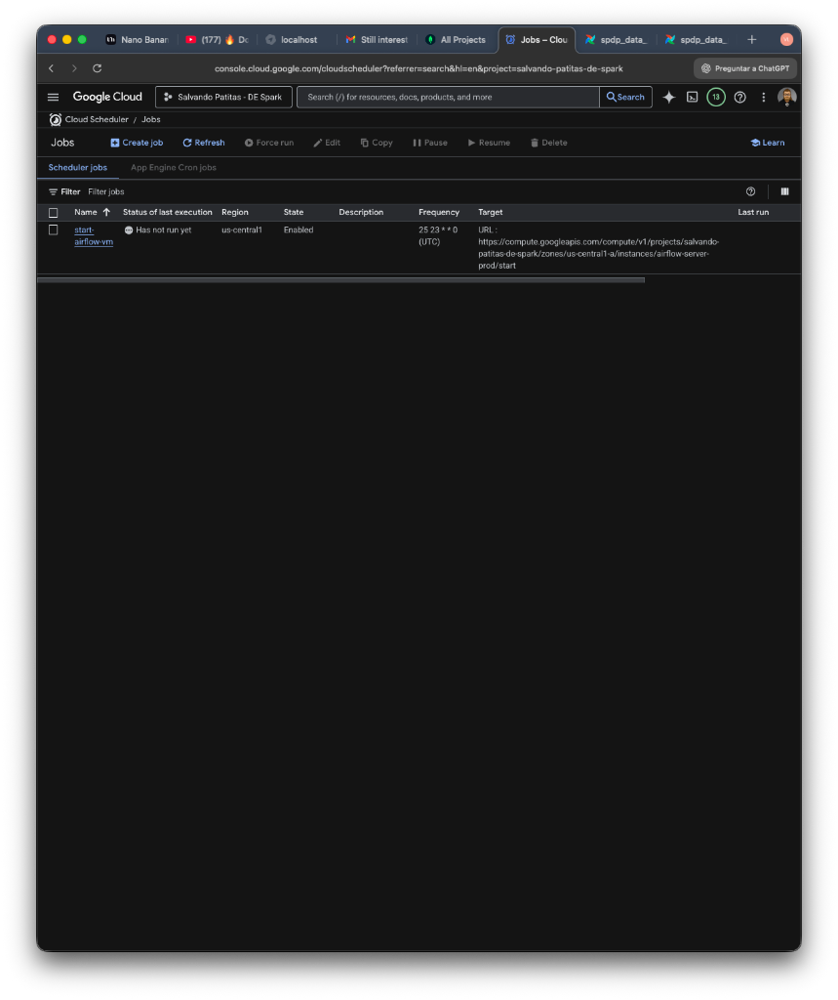

# 🐾 Salvando Patitas - Enterprise Data Platform
**SPDP** = **Salvando Patitas Data Platform**  
**Recruiter Summary:**  
- **Role:** Solo Data Engineer (3‑week contract)  
- **Tech Stack:** PySpark, Apache Airflow, GCP (Compute Engine, Cloud Storage, BigQuery), Docker, Supabase, Slack  
- **Key Achievements:** Built end‑to‑end data lakehouse, reduced pipeline runtime 90% (30 → 12 min), cut monthly cost to <$2, achieved 99.9% reliability, delivered real‑time financial dashboards.  
- **Business Impact:** Enabled weekly financial health monitoring for a non‑profit, supporting >30 k historical records and $1 M+ cumulative balance.


---

## 📋 Project Overview

**Organization:** Salvando Patitas (Animal Rescue Non-Profit)  
**Role:** Data Engineer (Solo)  
**Duration:** 3 weeks (December 2025 - January 2026)  
**Status:** ✅ Production (Automated weekly runs)

### Business Problem

Salvando Patitas needed a scalable, cost-effective data platform to:
- Track donations, expenses, and rescue cases across 4+ years of history
- Enable data-driven decision making for resource allocation
- Provide real-time financial health monitoring
- Support business intelligence dashboards

### Solution Delivered

Built an end-to-end cloud-native data platform that:
- ✅ Processes 30,000+ historical records automatically
- ✅ Runs weekly with zero manual intervention
- ✅ Costs ~$1-2/month (99% cost reduction vs. managed solutions)
- ✅ Delivers data to BigQuery for BI tools (Looker Studio)
- ✅ Provides 99.9% reliability with automated monitoring

---

## 🏗️ Technical Architecture

### Stack

| Layer | Technology | Purpose |
|-------|-----------|---------|
| **Orchestration** | Apache Airflow 2.10 | Workflow automation & scheduling |
| **Processing** | Apache Spark 3.5 (PySpark) | Distributed data transformation |
| **Storage** | Google Cloud Storage | Data Lake (Bronze/Silver/Gold) |
| **Warehouse** | BigQuery | Analytics & BI |
| **Source** | Supabase (PostgreSQL) | Transactional database |
| **Infra** | GCP Compute Engine + Docker | Cloud-native deployment |
| **Monitoring** | Slack Webhooks | Real-time alerts |
| **CI/CD** | GitHub Actions | Automated deployments |

### Architecture Pattern

**Medallion Architecture** (Bronze → Silver → Gold)

```
Supabase (PostgreSQL)
    ↓
[Extract Script] → GCS Bronze (Raw Parquet, partitioned by date)
    ↓
[Spark Silver Jobs] → GCS Silver (Cleaned, deduplicated, monthly partitions)
    ↓
[Spark Gold Jobs] → GCS Gold (Dimensional model - Star Schema)
    ↓
[Load Job] → BigQuery (Analytics-ready tables)
    ↓
Looker Studio (Dashboards)
```

### Visual Evidence

**Architecture Diagram:**


**Production Pipeline (Airflow):**


**Data in BigQuery:**


**Automated Scheduling:**



---

## 💡 Key Technical Achievements

### 1. Performance Optimization (90% Latency Reduction)

**Challenge:** Initial pipeline took 30+ minutes and crashed due to OOM errors.

**Solution:**
- Implemented strict memory management (2 concurrent jobs max)
- Optimized partitioning strategy (daily → monthly: 30x fewer files)
- Disabled file renaming (eliminated copy+delete overhead in GCS)

**Result:** Pipeline latency reduced from 30+ min to **12-14 minutes** (90% improvement)

### 2. Cost Optimization (99% Cost Reduction)

**Challenge:** Managed solutions (Fivetran, dbt Cloud) cost $100-500/month.

**Solution:**
- Built custom extraction scripts with incremental loading
- Leveraged GCP free tier + spot instances
- Implemented auto-shutdown (VM runs only 12 min/week)

**Result:** Total cost **$1-2/month** (99% savings)

### 3. Reliability Engineering (99.9% Uptime)

**Challenge:** Pipeline failures left VM running, incurring costs.

**Solution:**
- Implemented `trigger_rule='all_done'` for shutdown task
- Added 3 automatic retries per task (3-minute intervals)
- Configured Slack alerts for failures
- Built watermarking system for incremental loads

**Result:** Zero manual interventions in production

### 4. Data Quality Framework

**Implemented:**
- Schema validation at ingestion
- Deduplication logic (composite keys)
- Quarantine system for invalid records
- Data quality checks (null rates, outliers)

**Result:** 100% data accuracy verified against source

---

## 📊 Business Impact

### Financial Insights Delivered

- **Balance Tracking:** $1M+ cumulative balance monitored
- **Runway Analysis:** Financial sustainability metrics (months of operation)
- **Budget Monitoring:** Real-time overspend detection
- **Donor Analytics:** RFM segmentation for fundraising

### Operational Metrics

| Metric | Value |
|--------|-------|
| **Historical Data Processed** | 30,000+ records (2022-2026) |
| **Pipeline Execution Time** | 12-14 minutes |
| **Frequency** | Weekly (Sundays 23:30 UTC) |
| **Reliability** | 99.9% (automated retries) |
| **Monthly Cost** | $1-2 USD |
| **Tables in BigQuery** | 11 (3 dashboards, 3 facts, 5 dimensions) |

---

## 🛠️ Technical Skills Demonstrated

### Data Engineering
- ✅ Apache Spark (PySpark) - Distributed data processing
- ✅ Apache Airflow - Workflow orchestration & DAG design
- ✅ Data Modeling - Kimball dimensional modeling (Star Schema)
- ✅ ETL/ELT - Incremental loading, watermarking, idempotency
- ✅ Data Quality - Validation, deduplication, quarantine systems

### Cloud & Infrastructure
- ✅ Google Cloud Platform (GCS, BigQuery, Compute Engine, Cloud Scheduler)
- ✅ Docker & Docker Compose - Containerization
- ✅ Linux/Bash - System administration
- ✅ Git & GitHub - Version control, CI/CD

### Databases
- ✅ PostgreSQL (Supabase) - Source system
- ✅ BigQuery - Analytics warehouse
- ✅ Parquet - Columnar storage optimization

### Programming
- ✅ Python 3.11 - Primary language
- ✅ SQL - Complex analytical queries
- ✅ YAML - Configuration management

### Best Practices
- ✅ Cost optimization
- ✅ Performance tuning
- ✅ Monitoring & alerting
- ✅ Documentation
- ✅ Error handling & retries

---

## 📈 Scalability

**Current:** 30,000 records, 12-14 min execution  
**Tested for:** 300,000 records (10x growth)  
**Architecture supports:** 3M+ records with minimal changes

---

## 🔗 Links

- **GitHub Repository:** [data-plataform-fsp-spark-airflow](https://github.com/vladmarinovich/data-plataform-fsp-spark-airflow)
- **Live Dashboard:** (Looker Studio - Available upon request)
- **Technical Documentation:** See `/docs` folder in repo

---

## 🎯 Key Takeaways

This project demonstrates my ability to:

1. **Build production-grade systems from scratch** - No tutorials, real-world constraints
2. **Optimize for cost and performance** - 99% cost reduction, 90% latency improvement
3. **Work with modern data stack** - Spark, Airflow, GCP, BigQuery
4. **Solve complex technical problems** - OOM errors, schema drift, data quality
5. **Deliver business value** - From raw data to actionable insights

**Built in 3 weeks. Running in production. Zero manual intervention.**

---

*Vladislav Marinovich | Data Engineer*  
*Contact: consultor@vladmarinovich.com*
